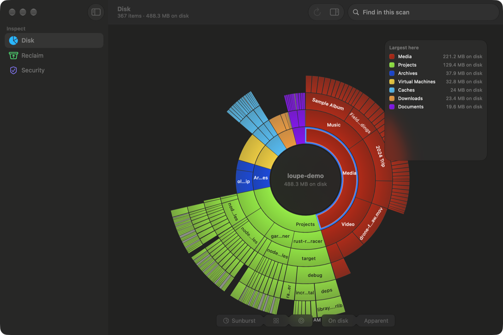

# Loupe



A macOS disk-usage visualiser and cache cleaner. It walks an entire APFS volume with a
hand-written parallel `getattrlistbulk` reader (two million files in about six seconds),
draws the result as a sunburst, treemap or bubble chart, and cleans up nineteen specific,
named caches, listing the exact paths before anything moves to the Trash.

macOS 26 or newer. Swift 6 with strict concurrency, SwiftUI + AppKit. Not sandboxed,
no network code of any kind, no account, no telemetry.

## Why it exists

Finder's "Available" disagrees with `df`, which disagrees with `du`, and most of the
difference ends up in a bucket labelled "System Data". The usual options are a
`du | sort` (correct, slow, unreadable) or a cleaner app that deletes the whole of
`~/Library/Caches` (hundreds of unrelated, app-owned directories) and calls that
maintenance.

The rule for the project: every number on screen has to be one the app can defend.
Physical *and* logical bytes are reported and labelled. The free-space gap is explained
instead of bucketed. Anything that is going to be deleted is named, with what breaks,
and goes to the Trash where it can be dragged back out.

## How it works

- **The walk.** A small C target decodes `getattrlistbulk` buffers; Swift runs it on a
  pool of dedicated threads (not the cooperative pool, because the syscall blocks).
  Dataless iCloud files are never materialised, symlinks are never followed.
- **The tree.** Entries land in two arenas of POD structs (32-byte files, 56-byte
  directories). Structure is append-only, so the chart can render while the walk is
  still running.
- **The UI.** `LoupeUI` cannot import the filesystem or tree packages; it only renders
  small `Sendable` projections, capped at a few thousand wedges whatever the volume size.
- **The cleaner.** One primitive (`FileManager.trashItem`), nineteen named targets and no
  pattern matching, and a closed-by-default safety engine that checks paths, inodes,
  file flags, running processes and volumes before allowing anything.

[docs/ARCHITECTURE.md](docs/ARCHITECTURE.md) has the full design, benchmark numbers, and
the detailed write-ups of the walk (§13) and the cleaner's safety rules (§14).

## Layout

Five local SPM packages, assembled into an app target by XcodeGen. The boundaries are
enforced by the package graph.

| package | what it owns |
|---|---|
| `LoupeCore` | `Sendable` value types shared by everything: `NodeRef`, `SizeBasis`, the chart contracts, `ScanEvent`, byte formatting. Zero dependencies. |
| `LoupeFS` | The `CLoupeFS` C target plus the walker, the thread pool, volume enumeration and snapshot accounting. |
| `LoupeTree` | The arenas, roll-up, and the sunburst/treemap/bubble layout maths. Pure and deterministic, with no filesystem access at all, which is why it is the most heavily tested package. |
| `LoupeUI` | Every view and the hand-rolled `Canvas` charts. Depends only on `LoupeCore`. |
| `LoupeReclaim` | Catalog, safety engine, blocklist, dry-run planner, trash executor. |

`App/` is wiring only: the composition root, the Full Disk Access gate, and the
controllers that bridge the engine to `@MainActor` state.

## Running it

Needs macOS 26+, Xcode 26+, and [XcodeGen](https://github.com/yonaskolb/XcodeGen).
There are no external Swift dependencies.

```sh
brew install xcodegen
xcodegen generate          # project.yml -> Loupe.xcodeproj (gitignored)
open Loupe.xcodeproj       # then Run
```

Full Disk Access is optional. Loupe detects it by attempting to read a TCC-protected
directory (there is no API to ask), and without it scans the home directory and says
which parts of the machine it cannot see. TCC keys the grant to the code-signing
identity, and local builds sign ad-hoc, so the grant has to be re-added after a rebuild.

The packages test independently and need no Xcode project:

```sh
for p in LoupeCore LoupeTree LoupeFS LoupeReclaim LoupeUI; do
  (cd Packages/$p && swift test)
done
```

Two `LoupeTree` tests also assert a layout time budget; that check only runs under
`swift test -c release`.

`LoupeFS` and `LoupeReclaim` both include tests that run against the real machine:
a throughput benchmark over `/Applications` and a full reclaim survey of the home
directory. They read and print; they do not delete. Together they take a couple of
minutes.

`Tools/adversarial/build-hostile-tree.sh` builds a decoy tree under `/private/tmp`
(near-miss names like `usr/localfoo` and `.git-backup`, hardlinks, symlink cycles) for
exercising the safety engine. Nothing real is linked in a way that could be destroyed.
`Tools/prototypes/` holds the throwaway C that validated the walk before any Swift was
written.

## Status

Unfinished. The disk view and the cleaner work end to end on the development machine,
and the app target builds clean on macOS 26.6 with Xcode 26.5 / Swift 6.3.2. What is
not done:

- **The security pillar is a placeholder pane.** The config-posture and trust-audit work
  is designed (`docs/specs/security-probes.md`, `docs/specs/privileged-helper.md`) but
  has no code yet. The privileged-helper design may not survive contact with reality: a
  launchd daemon can't present a TCC prompt, so a denial would be silent, and that
  spike hasn't been run.
- **Not notarized.** Builds are ad-hoc signed. The real distribution path (Developer ID +
  hardened runtime + notarization) is untested, and there is no release build to
  download.
- **The destructive-path tests have never run on a SIP-enabled Mac.** SIP is disabled on
  the development machine, so `SF_RESTRICTED` is set but not enforced there, and Loupe's
  own blocklist is the only thing standing between a bug and a system file. A passing
  safety test on that box proves less than it looks like it does.
- **Docs lag the code in places.** `docs/ARCHITECTURE.md` §0–12 is the original design;
  §13–14 describe what was built.
- Version is 0.1.0. Single-window, English only, no accessibility pass yet.

## Licence

MIT. See [LICENSE](LICENSE).
